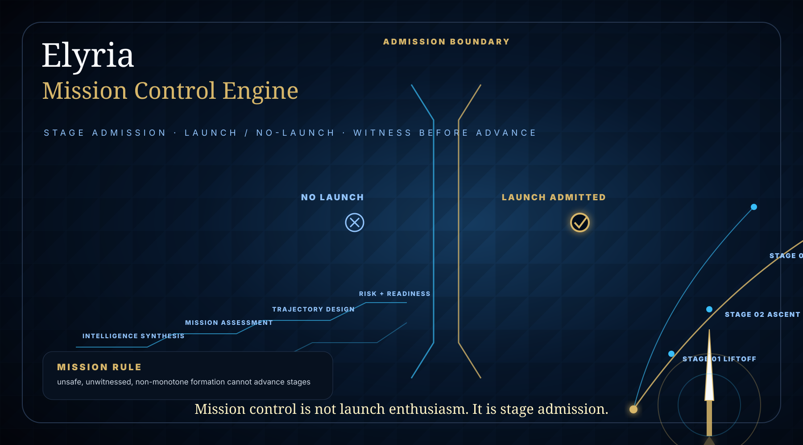

<div align="center">

# ELYRIA MISSION CONTROL ENGINE v0.1

### Controlled stage-admission proof surface for AI-assisted scientific and aerospace-facing engineering workflows

**ELYRIA SYSTEMS — VA**  
**Samantha Revita · Terry Snyder**

[](https://github.com/Kamanaka5502/elyria-mission-control-engine/actions/workflows/ci.yml)




</div>

---

## Mission Posture

This is a **NASA-facing controlled evaluation surface**.

It is not a claim of NASA affiliation, endorsement, certification, flight readiness, or deployment approval.

It is a bounded proof harness for one aerospace-relevant invariant:

```text
Unsafe, unwitnessed, non-monotone, or invalid engineering formation cannot advance stages.
```

---

## Core Proof

Most AI-scientific systems focus on generating candidates, simulations, or designs.

This engine focuses on whether a formation has standing to advance stages.

```text
The proof is not that the AI generated a design.

The proof is that no unsafe, unwitnessed, non-monotone, or invalid formation can advance toward simulation, claim, fabrication, or consequence.
```

---

## Mission-Control Invariant

```text
No scientific or engineering formation may advance stages unless it remains safe, witnessed, admissible, monotone, and receipt-bound.
```

---

## Aerospace-Facing Stage Chain

```text
candidate formation
→ Φ safety gate
→ Ψ potential posture
→ evidence completeness
→ witness standing
→ monotone stage check
→ stage admission decision
→ receipt
→ replay material
```

---

## Controlled Corridor

The public corridor is deliberately small:

```text
Design Note
→ Simulation Admission Request
→ Controlled Review
→ Certification Packet
```

The protected effect is **stage advancement**.

The protected effect is not propulsion, fabrication, flight execution, controlled technical data, or aerospace design instruction.

---

## Outcome Model

| Outcome | Mission meaning | Advancement posture |
|---|---|---|
| `ADMIT` | Stage advancement is permitted | May advance |
| `HOLD` | Formation is incomplete or near-boundary | No advancement |
| `REBOUND` | Return to prior valid stage | No new advancement |
| `REFUSE` | Formation lacks standing | No advancement |
| `HALT` | Safety or integrity failure | Stop corridor |
| `QUARANTINE` | Contaminated formation isolated | No advancement |
| `CERTIFY` | Bounded proof package ready for controlled review | May certify proof only |

---

## Public Demonstration Routes

```text
POST /mission/resolve
POST /stage/advance
POST /claim/attempt
POST /simulation/admit
```

These routes are public proof surfaces. They do not expose protected chemistry, fusion, materials, fabrication, field-equation, scoring, propulsion, aerospace design, or production substrate internals.

---

## Receipt Shape

Every stage decision produces receipt material:

```json
{
  "mission_decision_id": "md_...",
  "corridor_id": "aerospace_surrogate_corridor_v0_1",
  "stage_from": "DESIGN_NOTE",
  "stage_to": "SIMULATION_REQUEST",
  "candidate_hash": "sha256...",
  "policy_hash": "sha256...",
  "witness_hash": "sha256...",
  "outcome": "ADMIT",
  "reason_code": "STAGE_ADVANCEMENT_ADMITTED",
  "advanced": true,
  "invariant_holds": true,
  "receipt_hash": "sha256...",
  "replay_token": "replay_..."
}
```

---

## Proof Cases

```text
admit_simulation        → ADMIT      → advanced=true
refuse_no_witness       → REFUSE     → advanced=false
halt_safety_failed      → HALT       → advanced=false
rebound_non_monotone    → REBOUND    → advanced=false
quarantine_contaminated → QUARANTINE → advanced=false
```

---

## One-Command Proof Run

```bash
python -m app.prove --case all
```

Expected result:

```text
OVERALL: MISSION_CONTROL_INVARIANT_HOLDS
```

---

## What This Repository Exposes

```text
bounded stage-admission behavior
visible outcome semantics
receipt hashes
proof cases
replay material
no-advance posture for unsafe formations
controlled aerospace-facing evaluation language
```

## What This Repository Does Not Expose

```text
protected scoring law
private Φ/Ψ mappings
materials/fusion kernels
candidate-generation internals
fabrication exporters
geometry generation logic
propulsion or aerospace technical detail
export-controlled information
domain transfer mechanics
production runtime substrate
```

---

## Acceptance Condition

```text
If unsafe, unwitnessed, non-monotone, contaminated, or invalid formation can advance stages, the proof fails.
```

---

## External Language Boundary

Use:

```text
NASA-facing controlled evaluation surface
controlled aerospace evaluation corridor
stage-admission proof harness
AI-scientific mission-control invariant
```

Do not use:

```text
NASA certified
NASA approved
flight ready
rocket design package
propulsion system
fabrication-ready aerospace design
production aerospace deployment
```

---

## Public Posture

This repository is a public proof surface for Elyria Systems — VA.

It does not grant open-source rights, production deployment rights, commercial use rights, or access to protected implementation layers.
